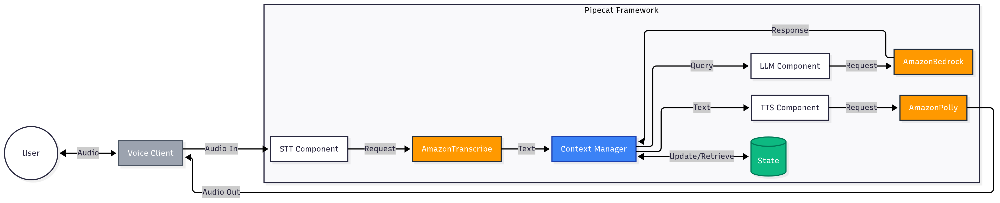

# Building Intelligent AI Voice Agents with Pipecat and Amazon Bedrock

This repo shows you how to build real-time, voice-enabled AI agents using a fork of the open-source [Pipecat](https://github.com/adithyaxx/pipecat/tree/add-bedrock-support) framework (and [Pipecat Flows](https://github.com/adithyaxx/pipecat-flows/tree/add-bedrock-support)) and [Amazon Bedrock](https://aws.amazon.com/bedrock/) foundation models. These forks contain support for Amazon Bedrock with pending PRs to the official Pipecat repositories.

_⚠️ The solution is not production ready and is an illustrative example only. The solution relies on an API from AWS Partner, [Daily](https://www.daily.co/). Daily can be purchased on [AWS Marketplace](https://aws.amazon.com/marketplace/seller-profile?id=d52484b0-a717-4b6d-a7aa-82f1c0c40b35). In practice, please use a [secrets management service](https://docs.aws.amazon.com/prescriptive-guidance/latest/aws-startup-security-baseline/wkld-03.html) to manage API keys and credentials_

## Overview

The following diagram illustrates the high-level architecture of this solution:



Key components include:
- Daily WebRTC streaming, Voice Activity Detection (VAD), noise suppression
- Amazon Transcribe (Speech-to-Text) + Amazon Bedrock (LLM) + Amazon Polly (Text-to-Speech)
- [Pipecat Flows](https://github.com/pipecat-ai/pipecat-flows) for dialog management and task execution

Built by [AWS Generative AI Innovation Center](https://aws.amazon.com/ai/generative-ai/innovation-center/). Ideal for anyone looking to quickly prototype voice AI agents for various use cases.

## Quick Start

### First, start the bot server:

1. Navigate to the server directory:
   ```bash
   cd server
   ```
2. Create and activate a virtual environment:
   ```bash
   python3 -m venv venv
   source venv/bin/activate  # On Windows: venv\Scripts\activate
   ```
3. Install requirements:
   ```bash
   pip install -r requirements.txt
   ```
4. Update keys in .env:
    ```ini
    DAILY_API_KEY=XXXX
    AWS_ACCESS_KEY_ID=XXXX
    AWS_SECRET_ACCESS_KEY=XXXX
    AWS_SESSION_TOKEN=XXXX
    AWS_REGION=XXXX
     ```
5. Start the server:
   ```bash
   python server.py
   ```

### Next, connect using the prebuilt client app:

1. Visit http://localhost:7860

2. Allow microphone access when prompted

3. Wait for the bot to speak

## Requirements

- Python 3.10+
- Daily API key
- AWS access keys
- Modern web browser with WebRTC support

## Project Structure

```
pipecat-voice-agent/
├── server/              # Bot server implementation
│   ├── bot.py/          # Pipecat pipeline implementation
│   ├── flow.py/         # Pipecat flow config
│   ├── server.py        # FastAPI server
│   └── requirements.txt
```

## ChromaDB Deployment Process

This section outlines the steps required to deploy and authenticate ChromaDB using Docker, as well as how to connect to the ChromaDB server via Python.

### 1. Download the ChromaDB Image
Start by pulling the latest ChromaDB image from Docker Hub:
```bash
docker pull chromadb/chroma:latest
```

### 2. Create Authentication Credentials
Create a password for authentication and save it in the container:
```bash
sudo docker run --rm --entrypoint htpasswd httpd:2 -Bbn ADMIN YOURPASSWORD > server.htpasswd
sudo docker cp server.htpasswd chromaDB:/server.htpasswd
```
- `ADMIN`: The username for authentication.
- `YOURPASSWORD`: The password for the chosen username.

### 3. Run the ChromaDB Server
Start the ChromaDB server with authentication by running the following command:
```bash
docker run -d -v ./server.htpasswd:/chroma/server.htpasswd \
    -e CHROMA_SERVER_AUTHN_CREDENTIALS_FILE="server.htpasswd" \
    -e CHROMA_SERVER_AUTHN_PROVIDER="chromadb.auth.basic_authn.BasicAuthenticationServerProvider" \
    -p 7878:8000 \
    chromadb/chroma:latest
```
This command mounts the `server.htpasswd` file, enabling basic authentication on the ChromaDB server.

### 4. Connect to the ChromaDB Server from a Python Client
To connect to the ChromaDB server using a Python client, you can use the following setup:

```python
from chromadb import HttpClient
from chromadb.config import Settings

chroma_client = HttpClient(
    settings=Settings(
        chroma_client_auth_provider="chromadb.auth.basic_authn.BasicAuthClientProvider",
        chroma_client_auth_credentials=f"{chromadb_user}:{chromadb_pwd}",
    ),
    host=chromadb_host,
    port=7878,
)
```
- `chroma_client_auth_provider`: Specifies the authentication provider.
- `chroma_client_auth_credentials`: Combines the username and password for authentication.
- `host`: The address of the ChromaDB server.
- `port`: The port the ChromaDB server is running on (`7878`).

Ensure that `chroma_client_auth_credentials` contains the correct credentials in the format `username:password`.


## Contributors

- [Adithya Suresh](https://www.linkedin.com/in/adithyaxx/) - Deep Learning Architect, AWS Generative AI Innovation Center

- [Daniel Wirjo](https://www.linkedin.com/in/wirjo/) - Senior Solutions Architect, AWS Generative AI Startups

## Security

See [CONTRIBUTING](CONTRIBUTING.md#security-issue-notifications) for more information.

## License

This library is licensed under the MIT-0 License. See the LICENSE file.
